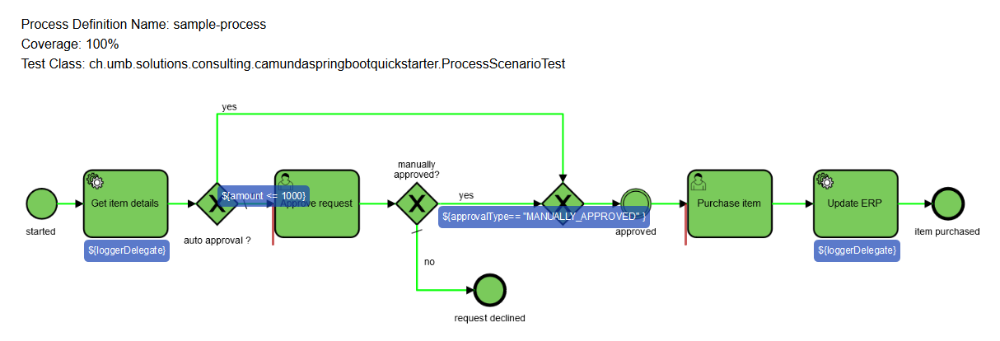

# camunda-spring-boot-quickstarter
Dockerized quick-start template for a Camunda EE 7.13.4 Spring Boot process applications with Gradle.
For Camunda CE version update *build.gradle* accordingly and disable Camunda EE dependencies.
Support for Camunda process testing including process test coverage report for non Sprint Boot tests.
H2 database is used as the default database. Configuration for postgres is provided and can be enabled if needed. 

## Getting Started
**Note:** create a *gradle.properties* file in the root project folder with your own appropriate connection variables 
to get the camunda-bpm-ee artifacts for building the template.
```
CamundaNexusUser=your_username
CamundaNexusPassword=your_password
```
To enable Camunda BPM enterprise features, add your Camunda enterprise license key file
 *camunda-license.txt* to *resources* folder

```
--------------- BEGIN CAMUNDA BPM LICENSE KEY ---------------
abcdeOluEJmmJIacJIgdizbHQVM8LRxMswO+bbsx9v95QAfnRC+l1o=;
Your Name;unlimited
--------------- END CAMUNDA BPM LICENSE KEY ---------------
```

### H2 Database  
Add application-h2.yaml to application.yaml
Add the following dependency to build.gradle and remove postgres dependency.
```
implementation "com.h2database:h2"
```

### Postgres Database  
Add application-postgres.yaml to application.yaml
Add the following dependency to build.gradle and remove H2 dependency.
```
implementation "org.postgresql:postgresql"
```
### Testing 
The process test coverage report works for Camunda unit tests. The Spring Boot 
tests  do not generate a process test coverage report.

**Note:**
When running both Camunda spring boot integration tests and Camunda unit tests in parallel,
please do not forget to clean-up the current process engine using @AfterClass annotation.

### Gradle Wrapper
This project makes use of the Gradle Wrapper for dependency management. To update the wrapper version adjust the placeholder NEW_GRADLE_VERSION with the desired version and execute the following command in a terminal pointing to the root of this project folder:
```
./gradlew wrapper --gradle-version=NEW_GRADLE_VERSION --distribution-type=all
```
*New versions can be found on the following GitHub page: [Gradle Releases](https://github.com/gradle/gradle/releases)*